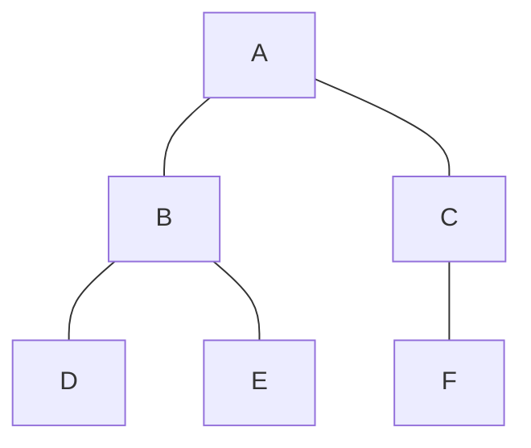

# Sequencer

## 概要

ゲームのステートを管理するためのコンポーネント。

階層状にゲームステートを管理し、階層を介してステート間を移動する仕組み。

例）以下のような構造があったとき、



**DからFに遷移する場合**

階層を含めたステートで示すと、

A-B-D → A-C-Fの移動なので、

```
D → B → A → C → F
```

1. Exit D
1. Exit B
1. Enter C
1. Enter F

という処理になる。

&nbsp;

**DからEに遷移する場合**

DとEは共通の親から分岐しているので、

1. Exit D
1. Enter E

のみの処理となる。

&nbsp;

## 実装サンプル

```
public static class SampleSequencer {
    // 複数のSequencerContextを扱う場合の識別子。
    private const int CONTEXT_KEY = 1;

    [UnityEngine.RuntimeInitializeLoadType.AfterSceneLoad]
    static void Initialize() {
        SequencerContext.Create(CONTEXT_KEY, root => {
            SequenceNode.Create(root, new TitleSequence())
                .WithChildren(
                    SequenceNode.Create(new TitleLaunchSequence()),
                    SequenceNode.Create(new TitleSelectSequence())
                );
            SequenceNode.Create(root, new IngameSequence())
                .WithChildren(
                    SequenceNode.Create(new ActionSequence()),
                    SequenceNode.Create(new EventSequence())
                        .WithChildren(
                            SequenceNode.Create(new Event1Sequence()),
                            SequenceNode.Create(new Event2Sequence())
                        )
                );
            SequenceNode.Create(root, new QuitSequence())
        });
    }
}

public class IngameSequence : ILayeredSequence {
    private const int SEQ_INGAME = 2;

    int ILayeredSequence.SequenceId => SEQ_INGAME;

    Task ILayeredSequence.OnEnter(SequencerContext context) {
        // Enter Process
    }

    Task ILayeredSequence.OnExit(SequencerContext context) {
        // Exit Process
    }

    void ILayeredSequence.OnUpdate(SequencerContext context) {
        // Update
    }
}
```

> [!NOTE]
> 実際の運用では、SequenceIdはEnumをintにして返すようにすると重複しないのでおすすめ。

&nbsp;

## シーケンスの遷移

シーケンスの遷移は、以下のいずれかで行う。内部的にはどちらもSequenceRequestを生成してSequencerSystemで切り替えるようになっている。

**SequencerContextのインスタンスから行う**
```
SequencerContext.RequestSequence(int sequenceId)
```

**ECSのSequenceRequest用Entityを生成する**
```
EntityCommandBuffer.AddComponent(entity, new SequenceRequest { contextKey = key, sequenceId = id});
```

&nbsp;

> [!CAUTION]
> 遷移は順番にTaskを処理する形で非同期に実行される。
>
> 遷移の処理中は以下の点に注意。
> * onUpdate()が処理されなくなる。
> * 遷移リクエストは無視される。

[back](./_.md)